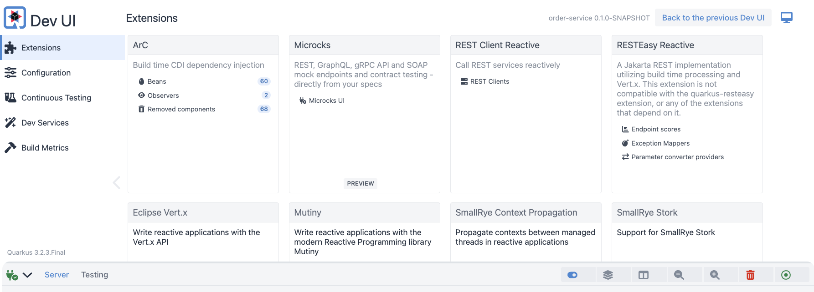
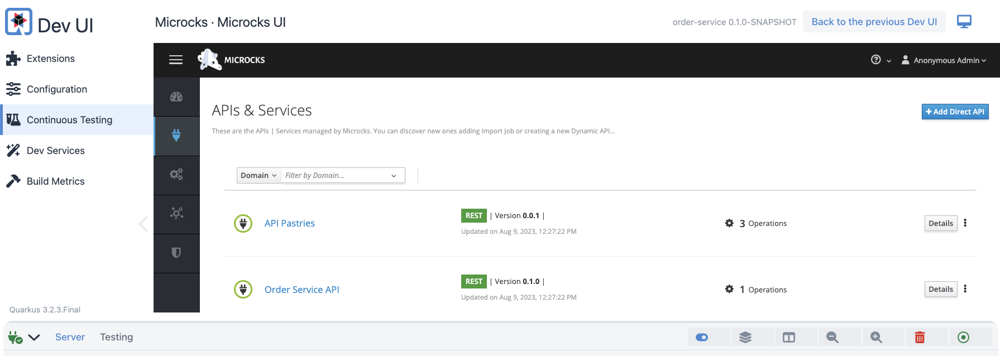

# Microcks Quarkus

Quarkus extension that enables embedding Microcks as a Dev Service managing mocks for dependencies and contract-testing your API endpoints

Want to see this extension in action? Check out our [sample application](https://github.com/microcks/microcks-quarkus-demo). 🚀

[](https://github.com/microcks/microcks-quarkus/actions)
[]((https://search.maven.org/artifact/io.github.microcks.quarkus/quarkus-microcks-parent))
[](https://www.apache.org/licenses/LICENSE-2.0)
[](https://microcks.io/discord-invite/)

## Build Status

Latest released version is `0.2.5`.

Current development version is `0.2.6-SNAPSHOT`.

#### Sonarcloud Quality metrics

[](https://sonarcloud.io/summary/new_code?id=microcks_microcks-quarkus)
[](https://sonarcloud.io/summary/new_code?id=microcks_microcks-quarkus)
[](https://sonarcloud.io/summary/new_code?id=microcks_microcks-quarkus)
[](https://sonarcloud.io/summary/new_code?id=microcks_microcks-quarkus)
[](https://sonarcloud.io/summary/new_code?id=microcks_microcks-quarkus)
[](https://sonarcloud.io/summary/new_code?id=microcks_microcks-quarkus)
[](https://sonarcloud.io/summary/new_code?id=microcks_microcks-quarkus)

## How to use it?

### Include it into your project dependencies

If you're using Maven:
```xml
<dependency>
  <groupId>io.github.microcks.quarkus</groupId>
  <artifactId>quarkus-microcks</artifactId>
  <version>0.2.5</version>
  <scope>provided</scope>
</dependency>
```

Don't forget to specify the `provided` scope as the extension is just for easing your life during development mode and tests 👻

### Configuring the Dev Services

By default, and if global Dev Services are not disabled, Microcks Dev Service will run on next `mvn quarkus:dev`, launching 
a Microcks Testcontainer to handle your mock dependencies.  You can obviously fine-tune the configuration using properties 
in `application.properties`. Microcks related properties have the `quarkus.microcks` prefix.

You can explicitly disable Microcks Dev Service if you want save some resources at some point:

```properties
quarkus.microcks.devservices.enabled=false
```

The local URL exposed by the Microcks container Http port is automatically stored into the `quarkus.microcks.default.http` property.
Microcks container also exposes a gRPC URL for gRPC services, it is store into the `quarkus.microcks.default.grpc` property.
For convenient usage of the Quarkus gRPC client or other libraries, we also provide `quarkus.microcks.default.http.host`, 
`quarkus.microcks.default.http.port`, `quarkus.microcks.default.grpc.host` and `quarkus.microcks.default.grpc.port` properties.

Exposed URL is visible in the Quarkus startup logs:

```shell
Listening for transport dt_socket at address: 5005
2023-08-09 12:27:22,649 INFO  [io.git.mic.qua.dep.DevServicesMicrocksProcessor] (build-31) The 'default' microcks container is ready on http://localhost:65719
__  ____  __  _____   ___  __ ____  ______ 
 --/ __ \/ / / / _ | / _ \/ //_/ / / / __/ 
 -/ /_/ / /_/ / __ |/ , _/ ,< / /_/ /\ \   
--\___\_\____/_/ |_/_/|_/_/|_|\____/___/   
2023-08-09 12:27:23,169 INFO  [io.quarkus] (Quarkus Main Thread) order-service 0.1.0-SNAPSHOT on JVM (powered by Quarkus 3.2.3.Final) started in 4.935s. Listening on: http://localhost:8080
2023-08-09 12:27:23,170 INFO  [io.quarkus] (Quarkus Main Thread) Profile dev activated. Live Coding activated.
2023-08-09 12:27:23,170 INFO  [io.quarkus] (Quarkus Main Thread) Installed features: [cdi, microcks, rest-client-reactive, rest-client-reactive-jackson, resteasy-reactive, resteasy-reactive-jackson, smallrye-context-propagation, vertx]
```

You can also access to Microcks UI using the Quarkus DevUI on http://localhost:8080/q/dev-ui:





### Import content in Microcks

To use Microcks mocks or contract-testing features, you first need to import OpenAPI, Postman Collection, GraphQL, gRPC, HAR or
SoapUI artifacts. Artifacts can be imported as main/primary ones or as secondary ones. 
See [Multi-artifacts support](https://microcks.io/documentation/using/importers/#multi-artifacts-support) for details. 
Import is done automatically at container startup depending on your configuration.

By default, Microcks Dev Service automatically discover and load artifacts found in main resources folders (typically `src/main/resources`)
and test resources folders (typically `src/test/resources`).
In order to find the correct artifacts and make difference between primary and secondary ones, the Dev Service relies on naming conventions:
* All the files named `*-openapi.yml`, `*-openapi.yaml`, `*-openapi.json` will be imported as **primary** artifacts,
* All the files named `*-asyncapi.yml`, `*-asyncapi.yaml`, `*-asyncapi.json` will be imported as **primary** artifacts,
* All the files named `*.proto`, `*.graphql`, `*-soapui-project.xml` will also be imported as **primary** artifacts,
* All the files named `*postman-collection.json`, `*postman_collection.json` will be imported as **secondary** artifacts
* All the files named `*.har` will be imported as **secondary** artifacts,
* All the files named `*-metadata.yml`, `*-metadata.yaml` will also be imported as **secondary** artifacts,

If you want/need a fine control on what's loaded in container, you may use the `artifact.primaries` and `artifact.secondaries` 
configuration properties for that. They are comma-separated lists of paths to your OpenAPI, Postman, GraphQL, gRPC, HAR, or SoapUI artifacts.

```properties
quarkus.microcks.devservices.artifacts.primaries=target/classes/order-service-openapi.yaml,target/test-classes/third-parties/apipastries-openapi.yaml
quarkus.microcks.devservices.artifacts.secondaries=target/test-classes/third-parties/apipastries-postman-collection.json
```

Starting with version `0.2.3`, you can also use the `remote-artifact.primaries` and `remote-artifact.secondaries` configuration
properties to specify URLs to load remote artifacts within the Microcks Dev Service:

```properties
quarkus.microcks.devservices.remote-artifacts.primaries=https://raw.githubusercontent.com/microcks/microcks/master/samples/films.graphql
quarkus.microcks.devservices.remote-artifacts.secondaries=https://raw.githubusercontent.com/microcks/microcks/master/samples/films-postman.json
```

### Using mock endpoints for your dependencies

At development time or during your unit tests setup, you'd probably need to configure mock endpoints provided by Microcks 
containers to set up your base API url calls. For that, you have to configure the host exposition port and change URLs in config:

```properties
# Specify here the Mock URL provided by microcks devservices, referencing the quarkus.microcks.default.http
quarkus.rest-client."org.acme.order.client.PastryAPIClient".url=${quarkus.microcks.default.http}/rest/API+Pastries/0.0.1
```

### Launching new contract-tests

If you want to ensure that your application under test is conform to an OpenAPI contract (or many contracts),
you can launch a Microcks contract/conformance test using the local server port you're actually running. Microcks container
is automatically configured for being able to reach your local application on the configured or default `quarkus.http.test-port`:

```java
@ConfigProperty(name= "quarkus.http.test-port")
int quarkusHttpPort;

@ConfigProperty(name= "quarkus.microcks.default.http")
String microcksContainerUrl;

@Test
public void testOpenAPIContract() throws Exception {
  // Ask for an Open API conformance to be launched.
  TestRequest testRequest = new TestRequest.Builder()
      .serviceId("Order Service API:0.1.0")
      .runnerType(TestRunnerType.OPEN_API_SCHEMA.name())
      .testEndpoint("http://host.testcontainers.internal:" + quarkusHttpPort + "/api")
      .build();

  TestResult testResult = MicrocksContainer.testEndpoint(microcksContainerUrl, testRequest);
  assertTrue(testResult.isSuccess());
```

The `TestResult` gives you access to all details regarding success of failure on different test cases.

A comprehensive Quarkus demo application illustrating both usages is available here: [quarkus-order-service](https://github.com/microcks/api-lifecycle/tree/master/shift-left-demo/quarkus-order-service).

### Configure your Microcks image

By default, Microcks Dev Service will use the `quay.io/microcks/microcks-uber:latest` image that is the latest stable one.
However, you can specify a compatible image of your choice using the following property:

```properties
# Specify here the Microcks-uber image you want to use.
quarkus.microcks.devservices.image-name=quay.io/microcks/microcks-uber:nightly
```

### Advanced features with Async and Postman

Starting with version `0.2.0` the Microcks Dev Service also integrates Async API/Event Driven Architecture features and also
allow you to implement
[Different levels of API contract testing](https://medium.com/@lbroudoux/different-levels-of-api-contract-testing-with-microcks-ccc0847f8c97)
in your Inner Loop!

Based on the artifacts the Dev Service discovered or forced with configuration properties, the Dev Service may start additional containers
(`microcks-async-minion` and `microcks-postman-runtime`) that you may use for contract-testing. The group of containers has been
called an `ensemble`:

```properties
# Force the enablement/deactivation of Async API support.
quarkus.microcks.devservices.ensemble.async-enabled=true
# Customize the Microcks-uber-async-minion image you want to use.
quarkus.microcks.devservices.ensemble.async-image-name=quay.io/microcks/microcks-uber-async-minion:nightly

# Force the enablement/deactivation of Postman runtime support.
quarkus.microcks.devservices.ensemble.postman-enabled=true
# Customize the Microcks-postman-runtime image you want to use.
quarkus.microcks.devservices.ensemble.postman-image-name=quay.io/microcks/microcks-postman-runtime:nightly
```

#### Postman contract-testing

You can execute a `POSTMAN` test using an ensemble that way:

```java
// Ask for a Postman Collection conformance to be launched.
TestRequest testRequest = new TestRequest.Builder()
      .serviceId("Order Service API:0.1.0")
      .runnerType(TestRunnerType.POSTMAN.name())
      .testEndpoint("http://host.testcontainers.internal:" + quarkusHttpPort + "/api")
      .build();

TestResult testResult = MicrocksContainer.testEndpoint(microcksContainerUrl, testRequest);
```

#### Asynchronous API support

Asynchronous API in the Microcks Dev Service only supports [Apache Kafka](https://kafka.apache.org) at time of writing.
Additional bindings may be added in the future ; please tell us what you need!

##### Using mock endpoints for your dependencies

Kafka topics for publishing/receiving mock messages are directly created by Microcks on the bound Kafka broker found in the
running Dev Services list. These topics are named from the API name + API version + operation.

For example: when discovering an AsyncAPI named `Order Events API` with version `0.1.0` and operation `orders-reviewed` Microcks
will create and manage a `OrderEventsAPI-0.1.0-orders-reviewed` topic. You can reuse this value into your Kafka/Reactive Messaging
client configuration:

```properties
# Specify here the Mock Topic provided by microcks devservices, following the naming convention.
mp.messaging.incoming.orders-reviewed.connector=smallrye-kafka
mp.messaging.incoming.orders-reviewed.topic=OrderEventsAPI-0.1.0-orders-reviewed
```

##### Launching new contract-tests

Using contract-testing techniques on Asynchronous endpoints may require a different style of interacting with the Microcks
container. For example, you may need to:
1. Start the test making Microcks listen to the target async endpoint,
2. Activate your System Under Tests so that it produces an event,
3. Finalize the Microcks tests and actually ensure you received one or many well-formed events.

For that the `MicrocksContainer` now provides a `testEndpointAsync(String microcksContainerUrl, TestRequest request)` method that actually returns a `CompletableFuture`.
Once invoked, you may trigger your application events and then `get()` the future result to assert like this:

```java
// Start the test, making Microcks listen the endpoint provided in testRequest
CompletableFuture<TestResult> testRequestFuture = MicrocksContainer.testEndpointAsync(microcksContainerUrl, kafkaTest);

// Invoke the application to create an order.
Order createdOrder = service.placeOrder(info);

// You may check additional stuff on createdOrder...

// Get the Microcks test result.
TestResult testResult = testRequestFuture.get();
assertTrue(testResult.isSuccess());
```

##### Retrieving DevServices broker information

When running your AsyncAPI tests using Quarkus Dev Services for providing brokers, knowing the broker URL that 
is addressable by Microcks is not an easy thing.

To ease this, you can inject the Kafka broker URL and port using the `@InjectKafkaInternalEndpoint` annotation. 
This annotation  as well as the `MicrocksTestCompanion` Quarkus test resource are provided by the Microcks Quarkus 
extension within the `quarkus-microcks-test` module:

```java
[..]
import io.github.microcks.quarkus.test.InjectKafkaInternalEndpoint;
import io.github.microcks.quarkus.test.MicrocksTestCompanion;

@QuarkusTest
@QuarkusTestResource(MicrocksTestCompanion.class)
public class OrderServiceTests extends BaseTest {

   @Inject
   OrderService service;

   @InjectKafkaInternalEndpoint
   String kafkaInternalEndpoint;

   @Test
   void testEventIsPublishedWhenOrderIsCreated() {
      // Prepare a Microcks test.
      TestRequest kafkaTest = new TestRequest.Builder()
            .serviceId("Order Events API:0.1.0")
            .filteredOperations(List.of("SUBSCRIBE orders-created"))
            .runnerType(TestRunnerType.ASYNC_API_SCHEMA.name())
            .testEndpoint("kafka://%s/orders-created".formatted(kafkaInternalEndpoint))
            .timeout(5000L)
            .build();
      [..]
   }
}
```

